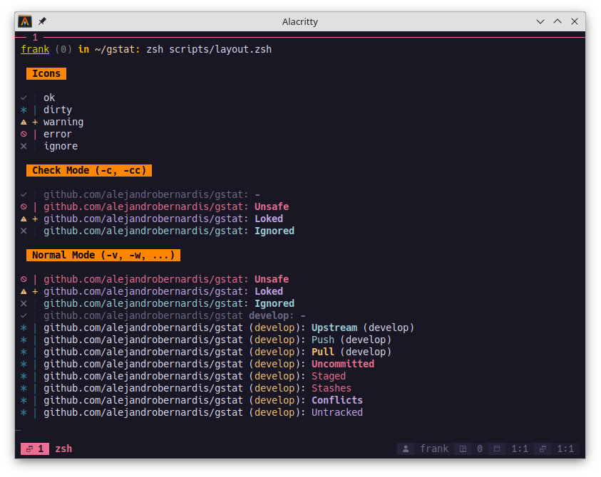

> [!WARNING]
> **WIP** - work in progress | **Only Linux support at the moment**

---

<br/>
<br/>
<p align="center">
  
</p>
<h1 align="center">gstat(1)</h1>
<h3 align="center">(a.k.a. GS1)</h3>
<p align="center">
  Show summary changes for multiple git repositories.
  <br/><strong>(alejandrobernardis/gstat)</strong>
</p>
<br/>
<br/>

---



> [!NOTE]
> [**gstat(1)**][man] manual page.

[man]: ./src/usr/share/doc/gstat/gstat.1.md

**gstat(1)** was created to solve the daily dynamics of finding outstanding
issues in local repositories, many of the expected statuses will not be
resolved.

**The current statuses are:**

- **Push**: if a branch is following a (remote) branch **behind** it.
- **Pull**: if a branch is following a (remote) branch **ahead** it.
- **Upstream**: if a branch does not have a local or remote **upstream** branch
configured.
- **Uncommitted**: if there are **uncommitted** changes pending in the local
repository.
- **Staged**: if there are **staged** changes in the local repository.
- **Stashes**: if there are **saved** changes in the local repository.
- **Untracked**: if there are **untracked** files that are not ignored in the
local repository.
- **Conflicts**: if there are **conflicts** pending in the current branch.

If you run in **check mode** (`-c`) it will show you all repositories
that are **Ignored** (`gstat.ignore=true`), **Locked** (`.git/index.lock`)
or **Insecure** (`non-owner`).

**Alternative paths to the [configuration][man-env] file:**

- `${HOME}/.gstat.conf`
- `${HOME}/.config/gstat/gstat.conf`
- `${HOME}/.local/etc/gstat.conf`
- `/usr/local/etc/gstat/gstat.conf`
- `/usr/etc/gstat/gstat.conf`
- `/etc/gstat/gstat.conf`

[man-env]: ./src/usr/share/doc/gstat/gstat.1.md#environment

**To ignore a repository:**

- You can set the `gstat.ignore` entry to `true` for each repository with:

    ```bash
    git config --local --bool gstat.ignore true
    ```

    <details>
    <summary>To <ins>stop ignoring</ins> or <ins>remove</ins>:</summary>

    ```bash

    # to stop ignoring
    git config --local --bool gstat.ignore false

    # to remove
    git config --local --unset gstat.ignore

    ```

    </details>

- In the `.gitconfig` file:

    ```
    # ~/.gitconfig

    [gstat]
      ignore = true

    ...
    ```

## Installation

> [!IMPORTANT]
>
> <details>
> <summary><ins>Make</ins> and <ins>ZSH</ins> are requiered.</summary>
>
> You can install the `make` and `zsh` packages from the official repository.
>
> ```bash
> sudo dnf install -y cmake zsh
> ```
>
> </details>

> [!TIP]
> Optional requires [Nerd Fonts][nerd-fonts]

[nerd-fonts]: https://www.nerdfonts.com/

### From source:

The quick way to install **gstat\(1\)** from source is:

> [!IMPORTANT]
> By default is installed in `~/.local`.

```bash
make install
```

<details>
<summary>To <ins>uninstall</ins> use:</summary>

> ```
> make uninstall
> ```
</details>

To install **gstat\(1\)** elsewhere:

```bash
sudo make install prefix=/usr/local
```

<details>
<summary>To <ins>uninstall</ins> use:</summary>

> ```
> sudo make uninstall prefix=/usr/local
> ```
</details>

## Targets

```text

 DEVELOPMENT
~~~~~~~~~~~~~~~~~~~~~~~~~~~~~~~~~~~~~~~~~~~~~~~~~~~~~~~~~~~~~~~~~~~~~~~~~~~~~
 image        -- Creates the container image.
  - distro     : Linux Distribution (fedora, opts: arch)
  - nocache    : Ignore container build cache (false, opts: true)
  - proxy      : Proxy endpoint <protocol://host-or-ip:port> (empty)
  - noproxy    : Proxy exceptions <host-or-ip> (localhost,127.0.0.1,...)
-----------------------------------------------------------------------------
 run          -- Starts the container.
  - persist    : Remove container after exit (false, opts: true)
  - dns        : DNS server <host-or-ip> (empty)
 shell        -- Access to the running container.
 kill         -- Destroys the container running.
-----------------------------------------------------------------------------

 INSTALLATION
~~~~~~~~~~~~~~~~~~~~~~~~~~~~~~~~~~~~~~~~~~~~~~~~~~~~~~~~~~~~~~~~~~~~~~~~~~~~~
 ⚠ By default is installed in `~/.local` or can set `prefix` to the desired
   path (i.e.): sudo make install prefix=/usr/local
-----------------------------------------------------------------------------
 install      -- Install components (alias: `i`).
  - prefix     : Installation path (${HOME}/.local)
 uninstall    -- Uninstall components (alias: `u`).
  - prefix     : Installation path (${HOME}/.local)
-----------------------------------------------------------------------------

 DISTRIBUTION
~~~~~~~~~~~~~~~~~~~~~~~~~~~~~~~~~~~~~~~~~~~~~~~~~~~~~~~~~~~~~~~~~~~~~~~~~~~~~
 ⚠ The RPM and PKG targets was designed to run into a container, please
   be careful.
-----------------------------------------------------------------------------
 rpm          -- Create the RPM package
 pkg          -- Create the PKG package
-----------------------------------------------------------------------------
 man          -- Create the linux manual
-----------------------------------------------------------------------------

```

## Inspiration

- [**mgitstatus**][mgitstatus] written by **Ferry Boender**.
- [**Rosé Pine**][rose-pine] terminal theme for [**Alacritty**][rose-pine-alacritty].
- [**Alacritty**][alacritty] terminal.

[mgitstatus]: https://github.com/fboender/multi-git-status
[rose-pine]: https://rosepinetheme.com/
[rose-pine-alacritty]: https://github.com/rose-pine/alacritty
[alacritty]: https://alacritty.org/

## License

**gstat(1)** is made available under the terms of the **MIT License**. See the
[LICENSE][gstat-license] file for license details.

Copyright (c) since 2024 [Alejandro M. BERNARDIS][gstat-repo].

[gstat-repo]: https://github.com/alejandrobernardis/gstat
[gstat-license]: https://raw.githubusercontent.com/alejandrobernardis/gstat/main/LICENSE

## ToDO

- [ ] Implement a logger
- [ ] Code review (optimization)

## Versions

|    Date    | Version | Author                 | Email                         | Description     |
| :--------: | :-----: | :--------------------- | :---------------------------- | :-------------- |
| 2024-07-07 |  1.0.0  | Alejandro M. BERNARDIS | alejandro.bernardis@gmail.com | Initial Version |

---

<p align="center">
  <span>
    (c) since 2024 Alejandro M. BERNARDIS, Buenos Aires, Argentina
    <br/>
      <a href="https://github.com/alejandrobernardis/gstat">github.com</a>
       | <a href="mailto:alejandro.bernardis@gmail.com">alejandro.bernardis@gmail.com</a>
  </span>
</p>
